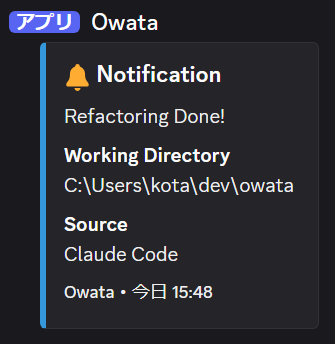

# Owata - Discord Notification CLI Tool

🔔 A simple tool for sending Discord webhook notifications from the command line. Perfect for coding agents like Claude Code and Gemini CLI to send completion notifications. Works cross-platform.



## ✨ Features

- 🖥️ **Cross-platform** - Works on Windows, macOS, and Linux
- 📨 **Rich notifications** - Sends beautiful notifications in Discord embed format
- ⚙️ **Flexible configuration** - Configure via config file or command-line arguments
- 🤖 **AI/LLM friendly** - Simple interface suitable for automation
- 🚀 **Easy setup** - Get started instantly with `owata init`

## 📦 Installation

### Using Go install

```bash
go install github.com/yashikota/owata@latest
```

### Download binary

Download the latest release from the [releases page](https://github.com/yashikota/owata/releases)

### Build from source

```bash
git clone https://github.com/yashikota/owata
cd owata
go build -o owata
```

## 🚀 Quick Start

### 1. Create config file

```bash
# Create local config file
owata init

# Or create global config file
owata init -g
```

### 2. Set Discord Webhook URL

```bash
# Local configuration
owata config --webhook="https://discord.com/api/webhooks/YOUR_WEBHOOK_ID/YOUR_WEBHOOK_TOKEN"

# Or global configuration
owata config -g --webhook="https://discord.com/api/webhooks/YOUR_WEBHOOK_ID/YOUR_WEBHOOK_TOKEN"
```

### 3. Send notification

```bash
owata "Task completed!"
```

## 📖 Usage

### Basic commands

```bash
# Send notification (simplest form if configured)
owata "Dependency update completed"

# Specify webhook URL directly
owata "Task completed" --webhook="https://discord.com/api/webhooks/YOUR_WEBHOOK_ID/YOUR_WEBHOOK_TOKEN"

# Specify source
owata "Code review completed" --source="Claude Code"

# Specify multiple options
owata "CI completed" --webhook="https://discord.com/api/webhooks/..." --source="GitHub Actions"
```

### Configuration commands

```bash
# Show current local configuration
owata config

# Show global configuration
owata config -g

# Set local webhook URL
owata config --webhook="https://discord.com/api/webhooks/..."

# Set global webhook URL
owata config -g --webhook="https://discord.com/api/webhooks/..."

# Set bot name in local config
owata config --username="MyBot"

# Set bot name in global config
owata config -g --username="GlobalBot"

# Update multiple settings at once
owata config --username="ProjectBot" --avatar="https://example.com/avatar.png"
```

### Other commands

```bash
owata --help        # Show help
owata --version     # Show version information
```

## ⚙️ Configuration

### Config files

- **Local config**: `owata-config.json` (current directory)
- **Global config**: `~/.config/owata-config.json` (home directory)

```json
{
  "webhook_url": "https://discord.com/api/webhooks/YOUR_WEBHOOK_ID/YOUR_WEBHOOK_TOKEN",
  "username": "Owata",
  "avatar_url": "https://example.com/avatar.png"
}
```

| Field | Description | Required |
|-------|-------------|----------|
| `webhook_url` | Discord Webhook URL | ✅ |
| `username` | Bot display name (default: "Owata") | ❌ |
| `avatar_url` | Bot avatar image URL | ❌ |

### Command-line options

| Command | Description |
|---------|-------------|
| `owata <message>` | Send notification (basic command) |
| `owata init` | Create local config file template |
| `owata init -g, --global` | Create global config file template |
| `owata config` | Show current local configuration |
| `owata config -g, --global` | Show current global configuration |
| `owata config --webhook=<url>` | Set local webhook URL |
| `owata config -g --webhook=<url>` | Set global webhook URL |
| `owata config --username=<n>` | Set bot name |
| `owata config --avatar=<url>` | Set avatar URL |
| `owata --help` | Show help |
| `owata --version` | Show version information |

| Option | Description |
|--------|-------------|
| `<message>` | Message to send (required) |
| `--webhook=<url>` | Discord Webhook URL (overrides config) |
| `--source=<source>` | Notification source (e.g., "Claude Code", "GitHub Actions") |
| `-g, --global` | Use global configuration |

## 🔗 Discord Webhook Setup

1. Open your Discord server settings
2. Navigate to **Integrations** → **Webhooks**
3. Click **New Webhook**
4. Select destination channel
5. **Copy the Webhook URL** and use it

📚 Details: [Discord Webhook Official Guide](https://support.discord.com/hc/en-us/articles/228383668-Intro-to-Webhooks)

## 💡 Practical Examples

### AI Development Agents

```bash
# Claude Code session completion
owata "Claude Code refactoring completed" --source="Claude Code"

# GitHub Copilot Chat usage (direct webhook URL)
owata "Copilot Chat code review completed" --webhook="https://discord.com/api/webhooks/..." --source="GitHub Copilot"

# Cursor IDE task completion
owata "Cursor feature implementation completed" --source="Cursor"
```

### CI/CD & Automation

```bash
# GitHub Actions (using config file)
owata "Deploy completed successfully" --source="GitHub Actions"

# Docker build completion (direct webhook URL)
owata "Docker image build completed" --webhook="https://discord.com/api/webhooks/..." --source="Docker"

# Test execution completion
owata "All tests passed successfully" --source="Jest"
```

### Development Workflow

```bash
# Long build completion
owata "Production deployment completed" --source="Production Deploy"

# Database migration
owata "Database migration completed" --source="DB Migration"

# Performance testing
owata "Load testing completed. Please check results" --source="Load Test"
```

## 📋 Notification Format

Discord notifications sent by Owata include the following information:

- 📝 **Message** - The specified text
- 📁 **Working Directory** - Directory path where command was executed
- 🏷️ **Source** - Source specified with `--source` (optional)
- ⏰ **Timestamp** - Notification send time
