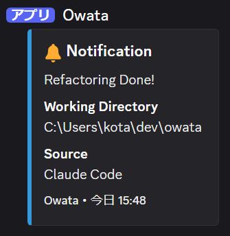

# Owata - Discord通知CLIツール

🔔 CLIからDiscordのWebhookを送信するシンプルなツールです。Claude CodeやGemini CLIなどのコーディングエージェントが完了通知を送信するのに最適で、クロスプラットフォームで動作します。



## ✨ 特徴

- 🖥️ **クロスプラットフォーム** - Windows、macOS、Linuxで動作
- 📨 **リッチな通知** - Discord embeds形式で美しい通知を送信
- ⚙️ **柔軟な設定** - 設定ファイルまたはコマンドライン引数で設定可能
- 🤖 **AI/LLMフレンドリー** - 自動化に適したシンプルなインターフェイス
- 🚀 **簡単セットアップ** - `owata init` で即座に設定開始

## 📦 インストール

### Go installを使用

```bash
go install github.com/yashikota/owata@latest
```

### バイナリをダウンロード

[リリースページ](https://github.com/yashikota/owata/releases)から最新版をダウンロード

### ソースからビルド

```bash
git clone https://github.com/yashikota/owata
cd owata
go build -o owata
```

## 🚀 クイックスタート

### 1. 設定ファイルを作成

```bash
# ローカル設定ファイルを作成
owata init

# または、グローバル設定ファイルを作成
owata init -g

# アバターURLをローカル設定に追加
owata config --avatar="https://github.com/username.png"

# アバターURLをグローバル設定に追加
owata config -g --avatar="https://github.com/username.png"
```

### 2. Discord Webhook URLを設定

```bash
# ローカル設定
owata config --webhook="https://discord.com/api/webhooks/YOUR_WEBHOOK_ID/YOUR_WEBHOOK_TOKEN"

# または、グローバル設定
owata config -g --webhook="https://discord.com/api/webhooks/YOUR_WEBHOOK_ID/YOUR_WEBHOOK_TOKEN"
```

### 3. 通知を送信

```bash
owata "タスクが完了しました！"
```

## 📖 使い方

### 基本的なコマンド

```bash
# 設定済みの場合（最もシンプル）
owata "依存関係のアップデートを完了しました"

# Webhook URLを直接指定
owata "タスク完了" --webhook="https://discord.com/api/webhooks/YOUR_WEBHOOK_ID/YOUR_WEBHOOK_TOKEN"

# ソースを指定
owata "コードレビューが完了しました" --source="Claude Code"

# 同時に指定も可能
owata "CI完了" --webhook="https://discord.com/api/webhooks/..." --source="GitHub Actions"
```

### 設定コマンド

```bash
# 現在の設定を表示（ローカル）
owata config

# グローバル設定を表示
owata config -g

# ローカル設定をコマンドラインで行う
owata config --webhook="https://discord.com/api/webhooks/..." --username="MyBot" --avatar="https://example.com/avatar.png"

# グローバル設定をコマンドラインで行う
owata config -g --webhook="https://discord.com/api/webhooks/..." --username="GlobalBot" --avatar="https://example.com/avatar.png"
```

### その他のコマンド

```bash
owata --help        # ヘルプを表示
owata --version     # バージョン情報を表示
```

## ⚙️ 設定

### 設定ファイル

- **ローカル設定**: `owata-config.json` (カレントディレクトリ)
- **グローバル設定**: `~/.config/owata-config.json` (ホームディレクトリ)

```json
{
  "webhook_url": "https://discord.com/api/webhooks/YOUR_WEBHOOK_ID/YOUR_WEBHOOK_TOKEN",
  "username": "Owata",
  "avatar_url": "https://example.com/avatar.png"
}
```

| フィールド | 説明 | 必須 |
|----------|------|------|
| `webhook_url` | Discord Webhook URL | ✅ |
| `username` | ボットの表示名（デフォルト: "Owata"） | ❌ |
| `avatar_url` | ボットのアバター画像URL | ❌ |

### コマンドライン オプション

| コマンド | 説明 |
|----------|------|
| `owata <message>` | 通知を送信（基本コマンド） |
| `owata init` | ローカル設定ファイルの雛形を作成 |
| `owata init -g, --global` | グローバル設定ファイルの雛形を作成 |
| `owata config` | 現在のローカル設定を表示 |
| `owata config -g, --global` | 現在のグローバル設定を表示 |
| `owata config --webhook=<url>` | ローカルWebhook URLを設定 |
| `owata config -g --webhook=<url>` | グローバルWebhook URLを設定 |
| `owata config --username=<n>` | ローカルのボット名を設定 |
| `owata config -g --username=<n>` | グローバルのボット名を設定 |
| `owata config --avatar=<url>` | ローカルのアバターURLを設定 |
| `owata config -g --avatar=<url>` | グローバルのアバターURLを設定 |
| `owata --help` | ヘルプを表示 |
| `owata --version` | バージョン情報を表示 |

| オプション | 説明 |
|----------|------|
| `<message>` | 送信するメッセージ（必須） |
| `--webhook=<url>` | Discord Webhook URL（設定を上書き） |
| `--source=<source>` | 通知のソース（例: "Claude Code", "GitHub Actions"） |
| `-g, --global` | グローバル設定を使用 |

## 🔗 Discord Webhookの設定

1. Discordサーバーの設定を開く
2. **連携サービス** → **Webhook** に移動
3. **新しいWebhook** をクリック
4. 送信先チャンネルを選択
5. **Webhook URLをコピー** して使用

📚 詳細: [Discord Webhook 公式ガイド](https://support.discord.com/hc/en-us/articles/228383668-Intro-to-Webhooks)

## 💡 実用例

### AI開発エージェント向け

```bash
# Claude Code セッション完了時
owata "Claude Codeによるリファクタリングが完了しました" --source="Claude Code"

# GitHub Copilot Chat使用後（Webhook URL直接指定）
owata "Copilot Chatでのコードレビューが完了しました" --webhook="https://discord.com/api/webhooks/..." --source="GitHub Copilot"

# Cursor IDE でのタスク完了時
owata "Cursorでの機能実装が完了しました" --source="Cursor"
```

### CI/CD・自動化

```bash
# GitHub Actions（設定ファイル使用）
owata "デプロイが正常に完了しました" --source="GitHub Actions"

# Docker ビルド完了（Webhook URL直接指定）
owata "Dockerイメージのビルドが完了しました" --webhook="https://discord.com/api/webhooks/..." --source="Docker"

# テスト実行完了
owata "全てのテストが正常に通過しました" --source="Jest"
```

### 開発ワークフロー

```bash
# 長時間のビルド完了
owata "本番環境へのデプロイが完了しました" --source="Production Deploy"

# データベースマイグレーション
owata "データベースマイグレーションが完了しました" --source="DB Migration"

# パフォーマンステスト
owata "負荷テストが完了しました。結果を確認してください" --source="Load Test"
```

## 📋 通知フォーマット

Owataが送信するDiscord通知には以下の情報が含まれます：

- 📝 **メッセージ** - 指定したテキスト
- 📁 **作業ディレクトリ** - コマンド実行時のディレクトリパス
- 🏷️ **ソース** - `--source` で指定した送信元（省略可能）
- ⏰ **タイムスタンプ** - 通知送信時刻
